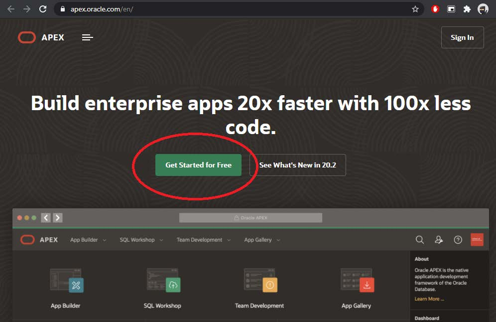
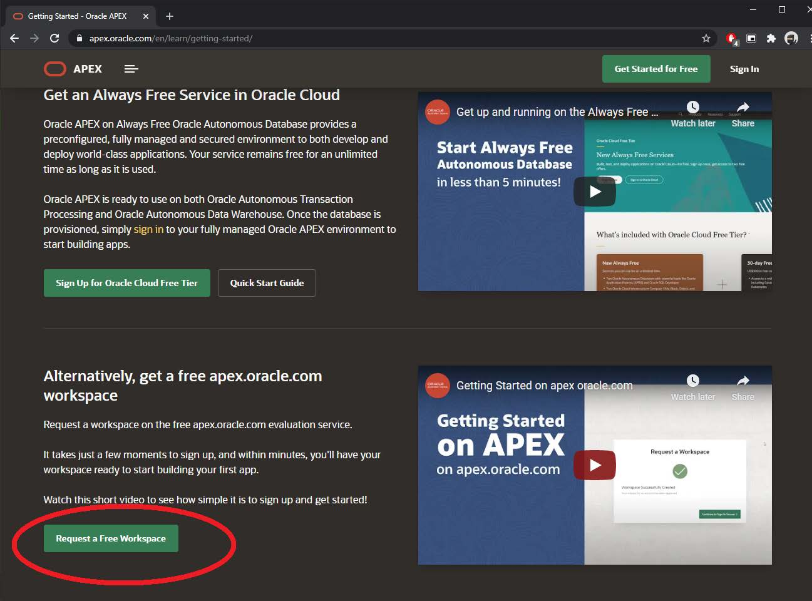
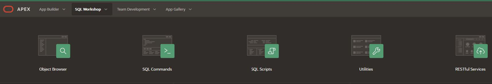
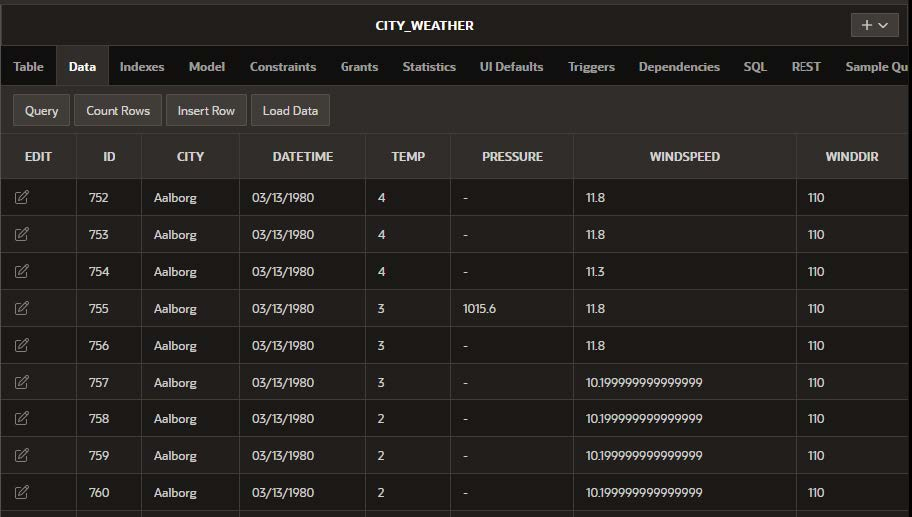
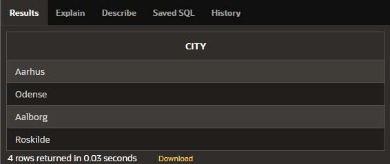
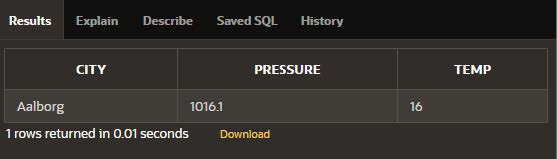
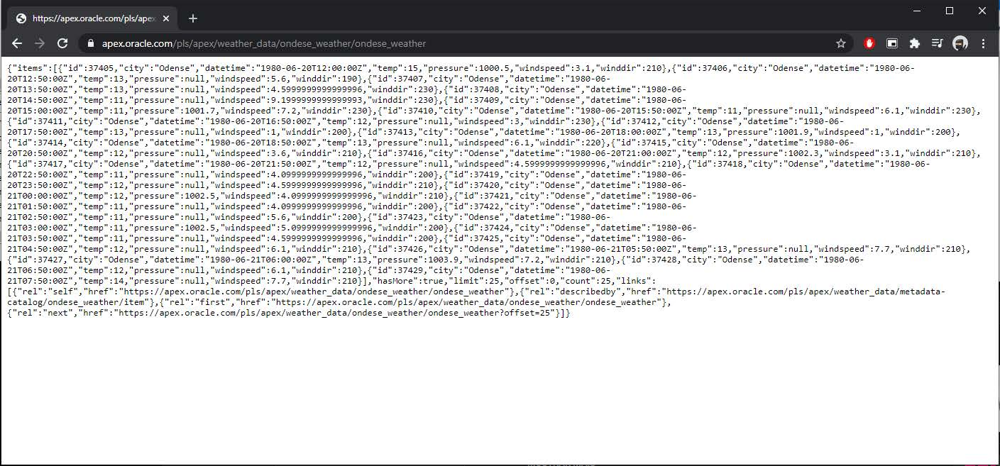

## 1 SQL - Structured Query Language

SQL is a standard language for storing, manipulating, and retrieving data in
databases.

SQL is based on Relational Database Management System (RDMS), which
is also the case for modern database systems such as MS SQL Server, IBM
DB2, Oracle, MySQL, and Microsoft Access. The data in RDBMS is stored in
database objects called tables. A table is a collection of related data entries and
it consists of columns and rows.

## 1.1 Oracle Apex

Oracle Application Express (Apex) is a platform that allows the low-code de-
velopment of front-end application based on DBMS Oracle

## 1.2 Signing-up for an Apex account

1. Access the Apex website:https://apex.oracle.com/en/
2. Sign up for a free account following the link ”Get started for free” (Figure
    1)
3. Choose the option: Request a free workspace (Figure 2)
4. Fill in the forms with the requested data:
    (a) Choose a name for your workspace.
(b) Answer the question “Why are you signing up for this service?” with
“University class usage”.
5. After receiving the confirmation email, follow the link contained in the
    email. Set the password and enter the oracle Apex application.

Figure 1:Apex home page

Figure 2:Request a free workspace

### 1.3 How to use SQL Workshop

Once you have access to Apex platform, select the option SQL Workshop. The
SQL Workshop dashboard (Figure 3) allows the following functionalities :

Figure 3:SQL Workshop dashboard

- Object Browser:
    A graphical tool that allows to visualize all components (tables, views,
    indexes) present in the database, and to add new ones
- SQL Commands:
    Provides an SQL interactive environment in which it is possible to write
    and execute SQL queries.
    Simply enter in your SQL within the command editor and then click Run.
    You can easily review the results of your command in the display pane at
    the bottom of the screen.
- SQL Script:
    Allows write and execute SQL scripts. A SQL script is a set of SQL
    commands saved as a file. A SQL script can contain one or more SQL
    statements or PL/SQL blocks. You can use SQL scripts to create, edit,
    view, run, and delete database objects
- Utilities:
    Gives access to extra functionalities more notably theDataWorkshopfunc-
    tionality allow to upload, download data form database in various formats.
- RESTful Services:
    A tool to create and manage RESTful services using the Oracle REST
    Data Services (ORDS) based repository. This feature allows you to define
    RESTful Web service endpoints, or URIs, which allow other applications
    to extract data from the underlying database objects.

## 2 Guided Tasks

### 2.1 Create Table database

Begin by loading our weather data from four cities in Denmark, from a spread-
sheet to a Table database.

Go to SQL Workshop−>Utilities−>Data Workshop−>Load xls file
”cityweather.xls”. Name the table ”CITYWEATHER” and click create.

Figure 4:Denmark City Weather database

You now have created a table CITYWEATHER that contains the weather
measures from four cities in 1980. For each weather measure, the following
information is available: a unique identification code (ID), city name, date
of the measure, temperature, atmospheric pressure, wind strength, and wind
direction.

### 2.2 Database Query - SELECT

To query data from databases, the SELECT statement is used. the SELECT
syntax is the following:

SELECT column1, column2, ... FROM table_name;

Where, column1, column2, ... are the field names of the table you want to select
data from. The data returned is returned in a table format.

Go to SQL Workshop−>SQL Commands, write an and run the following
SQL Query:

[1] SELECT * FROM CITY_WEATHER;

Using * will select all the fields available in the table, this command will return
all the data in the table.

Now run the SQL command:

[2] SELECT DISTINCT CITY FROM CITY_WEATHER;

The expected result of this command in show in Figure 5, it will return the
cities in present table. And by using the key work DISTINCT, will only return
distinct (different) values.

Figure 5:Expected result form SQL command [2]

### 2.3 Create Table using SQL CREATE, and INSERT

Create a second table, now containing information of the multiple cities. Al-
ternative to use SQL Workshop−>SQL Commands, you can go to SQL
Workshop−>SQL Scripts, and save the multiple SQL commands in a single
script.sqlfile and run the script.

Run the following SQL commands to create and populate a new table.

[4]
/* Delete old Table */
DROP TABLE CITY_DETAILS;

/* Create Table */
CREATE TABLE CITY_DETAILS
(CITY VARCHAR2(50) NOT NULL ,
POPULATION NUMBER,
LATITUDE NUMBER,
LONGITUDE NUMBER,
PRIMARY KEY(CITY) /* Unique Identifier of each registry */
);

/* Insert Data in Table */
INSERT INTO CITY_DETAILS (CITY, POPULATION, LATITUDE, LONGITUDE)
VALUES (’Aalborg’, 163231, 57.2, 9.55 );

INSERT INTO CITY_DETAILS (CITY, POPULATION, LATITUDE, LONGITUDE)

VALUES (’Aarhus’, 336411, 56.8, 10.13);

INSERT INTO CITY_DETAILS (CITY, POPULATION, LATITUDE, LONGITUDE)
VALUES (’Odense’, 185206, 55.23, 10.23 );

INSERT INTO CITY_DETAILS (CITY, POPULATION, LATITUDE, LONGITUDE)
VALUES (’Roskilde’, 50393, 55.38, 12.5 );

### 2.4 Query Specific information

A database can contain millions of records, therefore there is a need to filter the
results. The WHERE clause serves this purpose, it is used to extract only the
records that fulfill a specified condition.

For example the following SQL command will return the temperatures and dates
of measures of only the city of Arthus.

[5] SELECT TEMP, DATETIME FROM CITY_WEATHER
WHERE CITY =’Aarhus’;

The WHERE can also be used to establish a connection between multiple tables.
Run the next SQL command:

[6] SELECT CITY_WEATHER.CITY, PRESSURE, TEMP FROM CITY_DETAILS, CITY_WEATHER
WHERE CITY_DETAILS.CITY = CITY_WEATHER.CITY
AND CITY_WEATHER.DATETIME = ’06/07/1980’
AND CITY_DETAILS.LATITUTE > 57;

Figure 6:Expected result form SQL command [6]

This query returns the name of city, pressure, and temperature on the day
06/07/1980 for all the cities with a latitude over 57. To do this, the SQL com-
mand must query two different tables, the table with the weather information
and the table with city details. The name of the city is used as akeyto connect
both tables.

## 3 Open-ended Tasks:

Write SQL commands to return:

1. All the details about the cities.
2. The temperatures in Odense on the day 05/07/1980.
3. The dates and the wind speed when the wind direction was 100 in the city
    of Aalborg.
4. The name of all the cities and their respective populations.
5. The name of cities that have had temperatures lower than -15 Celsius.
6. The latitude and longitude of cities that have temperatures lower than -
    Celsius.

### 3.1 Create a RESTful API (optional)

The SQL Workshop−>RESTful Services feature allows you to define REST-
ful Web service endpoints, or URIs. In case you wish to setup your weather
database to be called by other applications (Web pages, python, etc..)

Figure 7, show a simple example, where url was setup to query the database
using the SQL command:

SELECT * FROM CITY_WEATHER WHERE CITY =’Odense’

It returns a JSON file with all weather information on the city of Odense.

Figure 7:Simple API example athttps://apex.oracle.com/pls/apex/
weather_data/ondese_weather/ondese_weather

