# Instructions

1. Create an account: ​https://account.mongodb.com/account/register?signedOut=true
    and sign in using the link you will receive in the confirmation email you will receive
    from mongoDB.
2. Name the project daps2020. Try not to use any space! Then select Next.
3. Choose the shared clusters (free version):

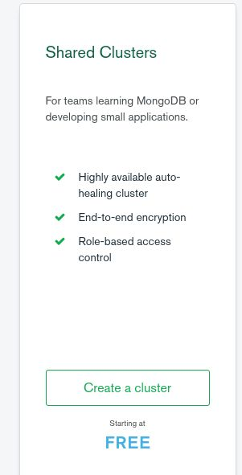

4. Choose AWS and Ireland:

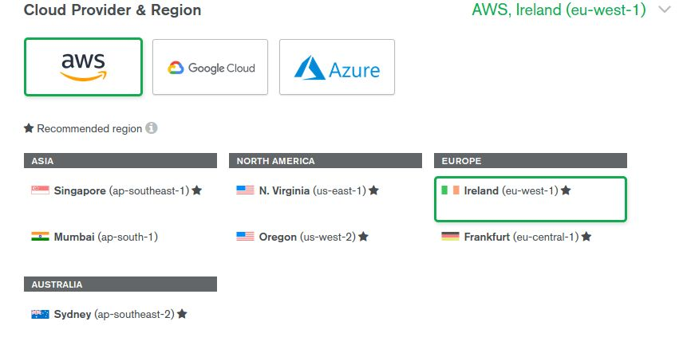

5. Next you will be redirected in a page that looks like the following:
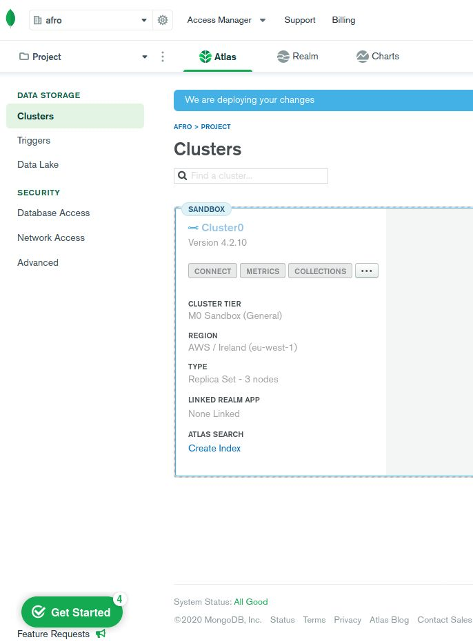

Notice the Get started button on the bottom-left. Click it and the following window will
pop-up:
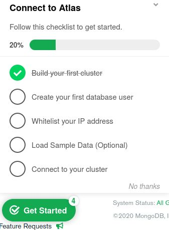

Follow the steps one-by-one as advised on this window. In particular:
a. Select ​ **Create your first database user** ​. Use a a username and password
you can remember:
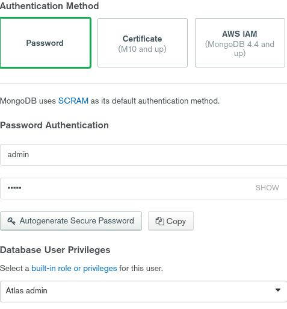

b. After you finish the previous step. the getting started pop-up window will ask
you to whitelist your ip address. You are advised to use ​ **ALLOW ACCESS
FROM ANYWHERE.** ​This is not secure, but it is an easiest way
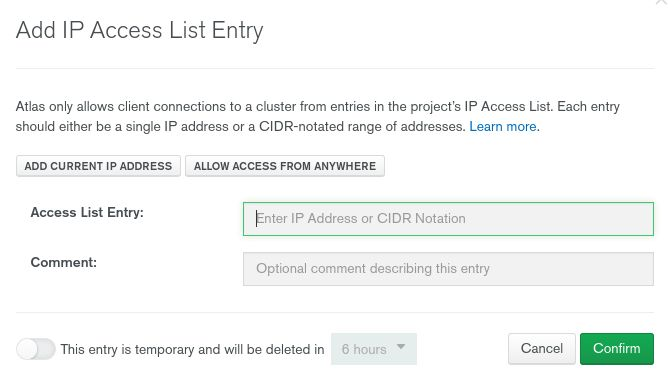

c. Next step is to create datasets. Select the following button:
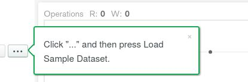

This will redirect you here:
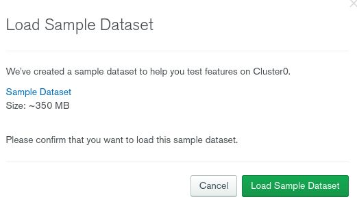

Press the ​ **Load Sample Dataset** ​.
d. Select connect button:
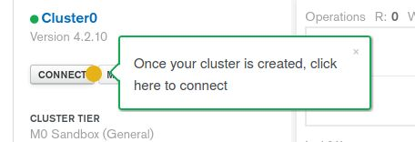

Choose the connect to your application option:
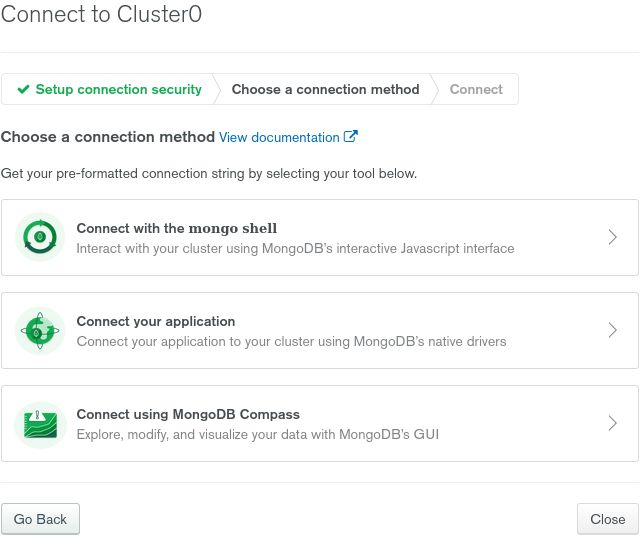

On the following window select ​ **python** ​ and ​ **3.6 or later option** ​. If you use
another python version you should select this version, however we advise you
to choose 3.6 or later and a python 3 environment.
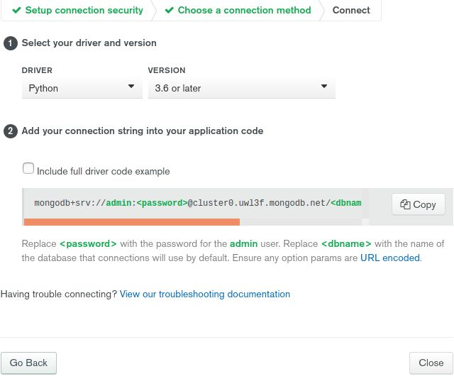

The link you will see relates to task 2.1.

